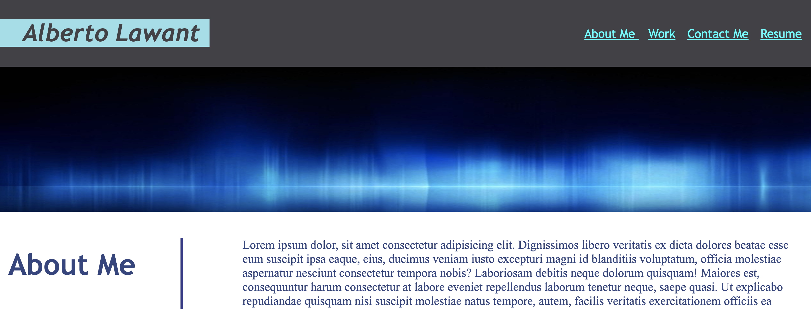

# personal_portfolio

# Description

This is a personal portfolio for my UCF bootcamp. Created from scratch, applying techniques and concepts I learned from my mentors.

- For training as well as job application.
- Applying concepts learned in class
- Maximazing learnability 

## Example

## Links

For access to deployed website [Click Here](https://parryprogramming.github.io/code_refactor/)